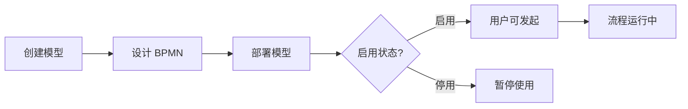
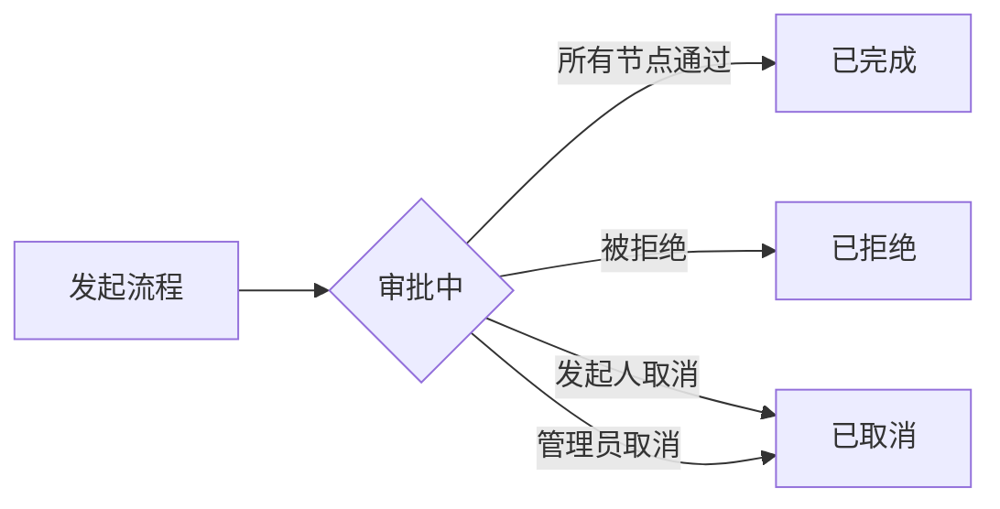
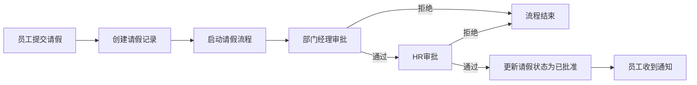
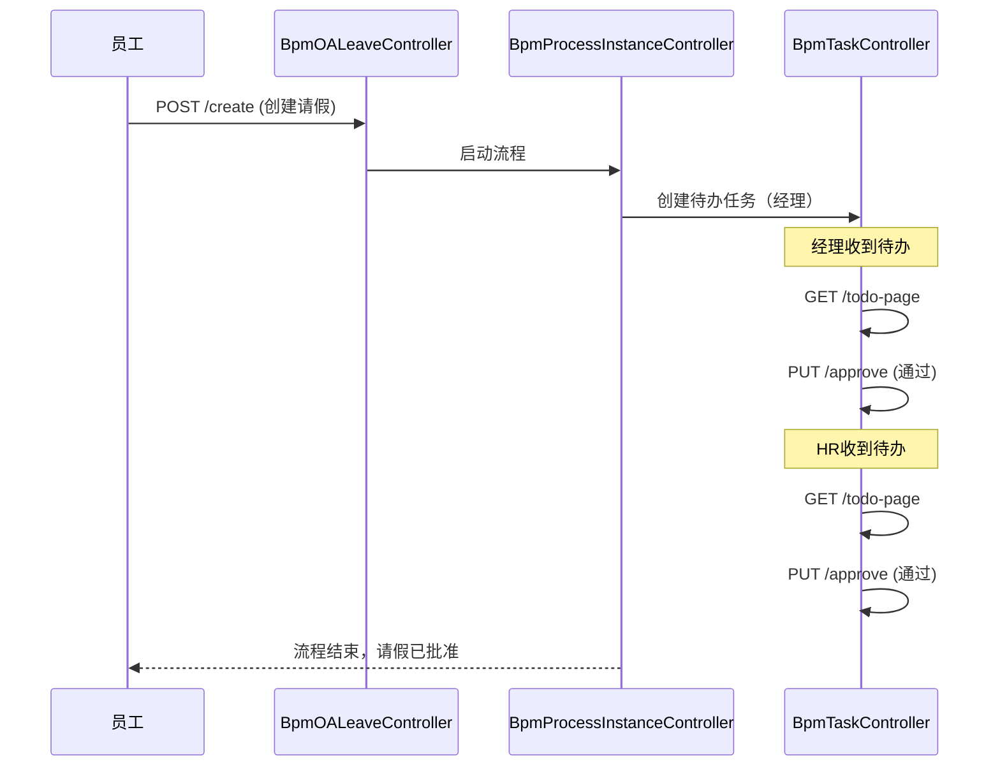

# BPM 工作流模块 - Controller 层接口文档

> 基于 Flowable 7.0.0 的工作流引擎，提供完整的流程设计、审批、管理功能

## 📋 目录

- [模块概述](#模块概述)
- [目录结构](#目录结构)
- [流程定义管理](#流程定义管理)
  - [BpmCategoryController - 流程分类](#1-bpmcategorycontroller---流程分类管理)
  - [BpmFormController - 动态表单](#2-bpmformcontroller---动态表单管理)
  - [BpmModelController - 流程模型](#3-bpmmodelcontroller---流程模型设计)
  - [BpmProcessDefinitionController - 流程定义](#4-bpmprocessdefinitioncontroller---流程定义管理)
  - [BpmProcessExpressionController - 流程表达式](#5-bpmprocessexpressioncontroller---流程表达式管理)
  - [BpmProcessListenerController - 流程监听器](#6-bpmprocesslistenercontroller---流程监听器管理)
  - [BpmUserGroupController - 用户组](#7-bpmusergroupcontroller---用户组管理)
- [流程执行管理](#流程执行管理)
  - [BpmTaskController - 任务管理](#8-bpmtaskcontroller---流程任务管理)
  - [BpmProcessInstanceController - 流程实例](#9-bpmprocessinstancecontroller---流程实例管理)
  - [BpmProcessInstanceCopyController - 抄送管理](#10-bpmprocessinstancecopycontroller---流程抄送管理)
- [业务示例](#业务示例)
  - [BpmOALeaveController - 请假流程](#11-bpmoaleavecontroller---oa-请假申请示例)
- [架构关系图](#架构关系图)
- [权限体系](#权限体系)
- [常见应用场景](#常见应用场景)

---

## 模块概述

BPM (Business Process Management) 模块是芋道 yudao-cloud 的核心功能模块之一，提供：

- **流程设计**：支持 BPMN 2.0 标准设计器和仿钉钉 Simple 设计器
- **动态表单**：可视化表单配置，无需编码即可生成流程表单
- **流程审批**：支持通过、拒绝、退回、转派、委派、加签、减签等全套审批操作
- **权限控制**：基于角色、部门、用户等多维度的权限控制
- **多租户隔离**：天然支持 SaaS 多租户架构
- **流程监控**：实时查看流程状态、历史记录、BPMN 流程图

**技术栈**：
- **工作流引擎**：Flowable 7.0.0
- **ORM 框架**：MyBatis Plus 3.5.7
- **缓存**：Redis + Redisson
- **API 路由**：`/admin-api/bpm/**`

---

## 目录结构

```
controller/
├── admin/                          # 管理后台接口
│   ├── definition/                 # 流程定义相关
│   │   ├── BpmCategoryController.java              # 流程分类
│   │   ├── BpmFormController.java                  # 动态表单
│   │   ├── BpmModelController.java                 # 流程模型
│   │   ├── BpmProcessDefinitionController.java     # 流程定义
│   │   ├── BpmProcessExpressionController.java     # 流程表达式
│   │   ├── BpmProcessListenerController.java       # 流程监听器
│   │   └── BpmUserGroupController.java             # 用户组
│   │
│   ├── task/                       # 流程执行相关
│   │   ├── BpmTaskController.java                  # 任务管理
│   │   ├── BpmProcessInstanceController.java       # 流程实例
│   │   └── BpmProcessInstanceCopyController.java   # 抄送管理
│   │
│   └── oa/                         # OA 业务示例
│       └── BpmOALeaveController.java               # 请假申请
│
└── app/                            # 移动端/用户端接口
    └── (待扩展)
```

---

## 流程定义管理

### 1. BpmCategoryController - 流程分类管理

**基础路径**: `/admin-api/bpm/category`
**功能说明**: 管理流程的业务分类（如人事、财务、行政等），便于流程归类和检索

#### 接口列表

| HTTP方法 | 接口路径 | 权限编码 | 功能描述 | 请求参数 | 返回类型 |
|---------|---------|---------|---------|---------|---------|
| POST | `/create` | `bpm:category:create` | 创建流程分类 | `BpmCategorySaveReqVO` | `Long` |
| PUT | `/update` | `bpm:category:update` | 更新流程分类 | `BpmCategorySaveReqVO` | `Boolean` |
| PUT | `/update-sort-batch` | `bpm:category:update` | 批量更新分类排序 | `ids: List<Long>` | `Boolean` |
| DELETE | `/delete` | `bpm:category:delete` | 删除流程分类 | `id: Long` | `Boolean` |
| GET | `/get` | `bpm:category:query` | 获得单个分类详情 | `id: Long` | `BpmCategoryRespVO` |
| GET | `/page` | `bpm:category:query` | 分页查询分类 | `BpmCategoryPageReqVO` | `PageResult<BpmCategoryRespVO>` |
| GET | `/simple-list` | 无 | 获取启用分类列表 | 无 | `List<BpmCategoryRespVO>` |

#### 示例

```bash
# 获取所有启用的分类（用于前端下拉框）
GET /admin-api/bpm/category/simple-list

# 响应示例
[
  {
    "id": 1,
    "name": "人事审批",
    "code": "hr",
    "sort": 1,
    "status": 0
  },
  {
    "id": 2,
    "name": "财务审批",
    "code": "finance",
    "sort": 2,
    "status": 0
  }
]
```

---

### 2. BpmFormController - 动态表单管理

**基础路径**: `/admin-api/bpm/form`
**功能说明**: 管理流程关联的动态表单，支持可视化表单设计器

#### 接口列表

| HTTP方法 | 接口路径 | 权限编码 | 功能描述 | 请求参数 | 返回类型 |
|---------|---------|---------|---------|---------|---------|
| POST | `/create` | `bpm:form:create` | 创建动态表单 | `BpmFormSaveReqVO` | `Long` |
| PUT | `/update` | `bpm:form:update` | 更新动态表单 | `BpmFormSaveReqVO` | `Boolean` |
| DELETE | `/delete` | `bpm:form:delete` | 删除动态表单 | `id: Long` | `Boolean` |
| GET | `/get` | `bpm:form:query` | 获得单个表单详情 | `id: Long` | `BpmFormRespVO` |
| GET | `/page` | `bpm:form:query` | 分页查询表单 | `BpmFormPageReqVO` | `PageResult<BpmFormRespVO>` |
| GET | `/simple-list` | 无 | 获取表单精简列表 | 无 | `List<BpmFormRespVO>` |

#### 字段说明

**BpmFormSaveReqVO**:
- `name`: 表单名称
- `conf`: 表单配置（JSON 格式，包含字段定义、布局等）
- `fields`: 表单字段列表（包含字段类型、验证规则等）
- `remark`: 备注

#### 示例

```json
// 创建表单请求示例
POST /admin-api/bpm/form/create
{
  "name": "请假申请表",
  "conf": "{\"labelWidth\":100,\"labelPosition\":\"top\"}",
  "fields": [
    {
      "label": "请假类型",
      "field": "type",
      "type": "select",
      "required": true
    },
    {
      "label": "开始时间",
      "field": "startTime",
      "type": "datetime",
      "required": true
    }
  ],
  "remark": "用于员工请假流程"
}
```

---

### 3. BpmModelController - 流程模型设计

**基础路径**: `/admin-api/bpm/model`
**功能说明**: 管理流程模型（BPMN 设计草稿），支持部署为正式流程定义

#### 核心接口

| HTTP方法 | 接口路径 | 权限编码 | 功能描述 | 请求参数 | 返回类型 | 备注 |
|---------|---------|---------|---------|---------|---------|------|
| GET | `/list` | 无 | 获取模型列表 | `name: String` | `List<BpmModelRespVO>` | 支持模糊查询 |
| GET | `/get` | `bpm:model:query` | 获取模型详情 | `id: String` | `BpmModelRespVO` | 包含 BPMN XML |
| POST | `/create` | `bpm:model:create` | 创建流程模型 | `BpmModelSaveReqVO` | `String` | 返回新模型ID |
| PUT | `/update` | `bpm:model:update` | 更新模型信息 | `BpmModelSaveReqVO` | `Boolean` | 修改名称、分类等 |
| PUT | `/update-sort-batch` | 无 | 批量更新排序 | `ids: List<String>` | `Boolean` | 按传入顺序排序 |
| POST | `/deploy` | `bpm:model:deploy` | 部署模型 | `id: String` | `Boolean` | ⭐ 发布为流程定义 |
| PUT | `/update-state` | `bpm:model:update` | 更新流程状态 | `BpmModelUpdateStateReqVO` | `Boolean` | 启用/停用流程定义 |
| DELETE | `/delete` | `bpm:model:delete` | 删除模型 | `id: String` | `Boolean` | 仅删除未部署模型 |
| DELETE | `/clean` | `bpm:model:clean` | 清理模型 | `id: String` | `Boolean` | ⚠️ 删除模型+所有部署 |

#### Simple 模式接口（仿钉钉设计器）

| HTTP方法 | 接口路径 | 权限编码 | 功能描述 | 请求参数 | 返回类型 |
|---------|---------|---------|---------|---------|---------|
| GET | `/simple/get` | 无 | 获取 Simple 模型 | `id: String` | `BpmSimpleModelNodeVO` |
| POST | `/simple/update` | `bpm:model:update` | 保存 Simple 模型 | `BpmSimpleModelUpdateReqVO` | `Boolean` |

#### 流程生命周期



#### 示例

```bash
# 1. 创建流程模型
POST /admin-api/bpm/model/create
{
  "key": "leave_process",
  "name": "请假流程",
  "description": "员工请假审批流程",
  "category": 1,          # 分类ID
  "formId": 100,          # 表单ID
  "formType": 10          # 表单类型：10=业务表单
}

# 2. 部署模型
POST /admin-api/bpm/model/deploy?id=model123

# 3. 启用流程定义
PUT /admin-api/bpm/model/update-state
{
  "id": "model123",
  "state": 1              # 1=激活, 2=挂起
}
```

---

### 4. BpmProcessDefinitionController - 流程定义管理

**基础路径**: `/admin-api/bpm/process-definition`
**功能说明**: 查看已部署的流程定义（只读），由模型部署后自动生成

#### 接口列表

| HTTP方法 | 接口路径 | 权限编码 | 功能描述 | 请求参数 | 返回类型 |
|---------|---------|---------|---------|---------|---------|
| GET | `/page` | `bpm:process-definition:query` | 分页查询流程定义 | `BpmProcessDefinitionPageReqVO` | `PageResult<BpmProcessDefinitionRespVO>` |
| GET | `/list` | 无 | 获取流程定义列表 | `suspensionState: Integer` | `List<BpmProcessDefinitionRespVO>` |
| GET | `/simple-list` | 无 | 获取精简列表 | 无 | `List<BpmProcessDefinitionRespVO>` |
| GET | `/get` | 无 | 获取单个流程定义 | `id` 或 `key` | `BpmProcessDefinitionRespVO` |

#### 字段说明

**suspensionState**:
- `1`: 激活状态（用户可发起）
- `2`: 挂起状态（暂停使用）

#### 示例

```bash
# 获取所有激活的流程定义
GET /admin-api/bpm/process-definition/list?suspensionState=1

# 响应示例
[
  {
    "id": "leave_process:1:1001",
    "key": "leave_process",
    "name": "请假流程",
    "version": 1,
    "suspensionState": 1,
    "formId": 100,
    "category": {
      "id": 1,
      "name": "人事审批"
    }
  }
]
```

---

### 5. BpmProcessExpressionController - 流程表达式管理

**基础路径**: `/admin-api/bpm/process-expression`
**功能说明**: 管理流程中使用的条件表达式（如网关分支条件、审批条件等）

#### 接口列表

| HTTP方法 | 接口路径 | 权限编码 | 功能描述 | 请求参数 | 返回类型 |
|---------|---------|---------|---------|---------|---------|
| POST | `/create` | `bpm:process-expression:create` | 创建表达式 | `BpmProcessExpressionSaveReqVO` | `Long` |
| PUT | `/update` | `bpm:process-expression:update` | 更新表达式 | `BpmProcessExpressionSaveReqVO` | `Boolean` |
| DELETE | `/delete` | `bpm:process-expression:delete` | 删除表达式 | `id: Long` | `Boolean` |
| GET | `/get` | `bpm:process-expression:query` | 获得单个表达式 | `id: Long` | `BpmProcessExpressionRespVO` |
| GET | `/page` | `bpm:process-expression:query` | 分页查询表达式 | `BpmProcessExpressionPageReqVO` | `PageResult<BpmProcessExpressionRespVO>` |

#### 应用场景

```javascript
// 示例1：金额条件判断
${amount > 5000}   // 大于5000走财务审批

// 示例2：请假天数条件
${days <= 3}       // 3天以内直接通过

// 示例3：部门条件
${deptId == 101}   // 特定部门走特殊流程
```

---

### 6. BpmProcessListenerController - 流程监听器管理

**基础路径**: `/admin-api/bpm/process-listener`
**功能说明**: 管理流程事件监听器，在流程执行的特定阶段触发自定义逻辑

#### 接口列表

| HTTP方法 | 接口路径 | 权限编码 | 功能描述 | 请求参数 | 返回类型 |
|---------|---------|---------|---------|---------|---------|
| POST | `/create` | `bpm:process-listener:create` | 创建监听器 | `BpmProcessListenerSaveReqVO` | `Long` |
| PUT | `/update` | `bpm:process-listener:update` | 更新监听器 | `BpmProcessListenerSaveReqVO` | `Boolean` |
| DELETE | `/delete` | `bpm:process-listener:delete` | 删除监听器 | `id: Long` | `Boolean` |
| GET | `/get` | `bpm:process-listener:query` | 获得单个监听器 | `id: Long` | `BpmProcessListenerRespVO` |
| GET | `/page` | `bpm:process-listener:query` | 分页查询监听器 | `BpmProcessListenerPageReqVO` | `PageResult<BpmProcessListenerRespVO>` |

#### 监听器类型

- **start**: 流程启动事件
- **end**: 流程结束事件
- **take**: 连线经过事件
- **task-create**: 任务创建事件
- **task-complete**: 任务完成事件

---

### 7. BpmUserGroupController - 用户组管理

**基础路径**: `/admin-api/bpm/user-group`
**功能说明**: 管理用户组，便于批量指派审批人

#### 接口列表

| HTTP方法 | 接口路径 | 权限编码 | 功能描述 | 请求参数 | 返回类型 |
|---------|---------|---------|---------|---------|---------|
| POST | `/create` | `bpm:user-group:create` | 创建用户组 | `BpmUserGroupSaveReqVO` | `Long` |
| PUT | `/update` | `bpm:user-group:update` | 更新用户组 | `BpmUserGroupSaveReqVO` | `Boolean` |
| DELETE | `/delete` | `bpm:user-group:delete` | 删除用户组 | `id: Long` | `Boolean` |
| GET | `/get` | `bpm:user-group:query` | 获得单个用户组 | `id: Long` | `BpmUserGroupRespVO` |
| GET | `/page` | `bpm:user-group:query` | 分页查询用户组 | `BpmUserGroupPageReqVO` | `PageResult<BpmUserGroupRespVO>` |
| GET | `/simple-list` | 无 | 获取启用用户组列表 | 无 | `List<BpmUserGroupRespVO>` |

#### 应用场景

```bash
# 创建用户组
POST /admin-api/bpm/user-group/create
{
  "name": "财务部审批组",
  "description": "所有财务部的审批人",
  "memberUserIds": [10, 20, 30],  # 用户ID列表
  "status": 0                      # 0=启用, 1=禁用
}

# 在流程设计中引用该组
审批节点配置 → 指派给用户组 → 选择"财务部审批组"
```

---

## 流程执行管理

### 8. BpmTaskController - 流程任务管理

**基础路径**: `/admin-api/bpm/task`
**功能说明**: 处理用户的待办/已办任务，执行审批操作（最核心的 Controller）

#### 8.1 查询类接口

| HTTP方法 | 接口路径 | 权限编码 | 功能描述 | 请求参数 | 返回类型 |
|---------|---------|---------|---------|---------|---------|
| GET | `/todo-page` | `bpm:task:query` | 获取我的待办任务分页 | `BpmTaskPageReqVO` | `PageResult<BpmTaskRespVO>` |
| GET | `/done-page` | `bpm:task:query` | 获取我的已办任务分页 | `BpmTaskPageReqVO` | `PageResult<BpmTaskRespVO>` |
| GET | `/manager-page` | `bpm:task:mananger-query` | 获取全部任务分页（管理员） | `BpmTaskPageReqVO` | `PageResult<BpmTaskRespVO>` |
| GET | `/list-by-process-instance-id` | `bpm:task:query` | 获取指定流程的任务列表 | `processInstanceId: String` | `List<BpmTaskRespVO>` |
| GET | `/list-by-return` | `bpm:task:update` | 获取可退回的节点列表 | `id: String` | `List<BpmTaskRespVO>` |
| GET | `/list-by-parent-task-id` | `bpm:task:query` | 获取子任务列表（减签用） | `parentTaskId: String` | `List<BpmTaskRespVO>` |

#### 8.2 审批操作接口 ⭐

| HTTP方法 | 接口路径 | 权限编码 | 功能描述 | 请求参数 | 返回类型 | 说明 |
|---------|---------|---------|---------|---------|---------|------|
| PUT | `/approve` | `bpm:task:update` | **通过任务** | `BpmTaskApproveReqVO` | `Boolean` | 同意审批，流向下一节点 |
| PUT | `/reject` | `bpm:task:update` | **拒绝任务** | `BpmTaskRejectReqVO` | `Boolean` | 不通过，流程结束或回到指定节点 |
| PUT | `/return` | `bpm:task:update` | **退回任务** | `BpmTaskReturnReqVO` | `Boolean` | 退回到历史节点重新处理 |
| PUT | `/delegate` | `bpm:task:update` | **委派任务** | `BpmTaskDelegateReqVO` | `Boolean` | 让他人代为处理，原任务保留 |
| PUT | `/transfer` | `bpm:task:update` | **转派任务** | `BpmTaskTransferReqVO` | `Boolean` | 直接转给他人，当前任务消失 |
| PUT | `/create-sign` | `bpm:task:update` | **加签** | `BpmTaskSignCreateReqVO` | `Boolean` | 增加前置/后置审批人 |
| DELETE | `/delete-sign` | `bpm:task:update` | **减签** | `BpmTaskSignDeleteReqVO` | `Boolean` | 移除已加签的子任务 |
| PUT | `/copy` | `bpm:task:update` | **抄送** | `BpmTaskCopyReqVO` | `Boolean` | 通知第三方但不影响流程 |
| PUT | `/withdraw` | `bpm:task:update` | **撤回** | `taskId: String` | `Boolean` | 撤销刚发起的流程 |

#### 操作流程图

```
待办任务
├─ ✅ 通过 (approve)    → 流向下一节点
├─ ❌ 拒绝 (reject)     → 流程结束或回到指定节点
├─ ⏮️ 退回 (return)     → 回到历史某节点
├─ 🔀 委派 (delegate)   → 给他人代处理（原任务保留）
├─ ➡️ 转派 (transfer)   → 给他人接手（当前任务消失）
├─ ➕ 加签 (create-sign) → 增加前置/后置审批人
├─ ➖ 减签 (delete-sign) → 删除加签任务
├─ 📋 抄送 (copy)        → 通知第三方
└─ ⏪ 撤回 (withdraw)    → 撤销刚发起的流程
```

#### 示例

```bash
# 1. 查询我的待办任务
GET /admin-api/bpm/task/todo-page?pageNo=1&pageSize=10

# 2. 通过任务
PUT /admin-api/bpm/task/approve
{
  "id": "task123",
  "comment": "同意请假申请",
  "variables": {               # 流程变量（可选）
    "approvalResult": true
  }
}

# 3. 加签（增加审批人）
PUT /admin-api/bpm/task/create-sign
{
  "id": "task123",
  "type": 20,                  # 10=前加签, 20=后加签
  "userIds": [100, 200],       # 新增审批人ID列表
  "reason": "需要技术总监审批"
}

# 4. 委派任务
PUT /admin-api/bpm/task/delegate
{
  "id": "task123",
  "delegateUserId": 888,       # 被委派人ID
  "reason": "出差中，委托小王代为处理"
}
```

---

### 9. BpmProcessInstanceController - 流程实例管理

**基础路径**: `/admin-api/bpm/process-instance`
**功能说明**: 管理已启动的流程实例，查看流程详情

#### 9.1 查询接口

| HTTP方法 | 接口路径 | 权限编码 | 功能描述 | 请求参数 | 返回类型 | 说明 |
|---------|---------|---------|---------|---------|---------|------|
| GET | `/my-page` | `bpm:process-instance:query` | 获取我的流程分页 | `BpmProcessInstancePageReqVO` | `PageResult<BpmProcessInstanceRespVO>` | 我发起或参与的流程 |
| GET | `/manager-page` | `bpm:process-instance:manager-query` | 获取全量流程分页 | `BpmProcessInstancePageReqVO` | `PageResult<BpmProcessInstanceRespVO>` | 管理员视图 |
| GET | `/get` | `bpm:process-instance:query` | 获取流程实例详情 | `id: String` | `BpmProcessInstanceRespVO` | 详情页使用 |

#### 9.2 创建流程

| HTTP方法 | 接口路径 | 权限编码 | 功能描述 | 请求参数 | 返回类型 |
|---------|---------|---------|---------|---------|---------|
| POST | `/create` | `bpm:process-instance:query` | **发起流程** | `BpmProcessInstanceCreateReqVO` | `String` |

#### 9.3 取消流程

| HTTP方法 | 接口路径 | 权限编码 | 功能描述 | 请求参数 | 返回类型 | 说明 |
|---------|---------|---------|---------|---------|---------|------|
| DELETE | `/cancel-by-start-user` | `bpm:process-instance:cancel` | 用户取消流程 | `BpmProcessInstanceCancelReqVO` | `Boolean` | 仅发起人可操作 |
| DELETE | `/cancel-by-admin` | `bpm:process-instance:cancel-by-admin` | 管理员取消流程 | `BpmProcessInstanceCancelReqVO` | `Boolean` | 强制取消 |

#### 9.4 审批详情

| HTTP方法 | 接口路径 | 权限编码 | 功能描述 | 请求参数 | 返回类型 |
|---------|---------|---------|---------|---------|---------|
| GET | `/get-approval-detail` | `bpm:process-instance:query` | 获取审批详情 | `BpmApprovalDetailReqVO` | `BpmApprovalDetailRespVO` |
| GET | `/get-next-approval-nodes` | `bpm:process-instance:query` | 获取下一节点 | `BpmApprovalDetailReqVO` | `List<ActivityNode>` |

#### 9.5 流程图相关

| HTTP方法 | 接口路径 | 权限编码 | 功能描述 | 请求参数 | 返回类型 | 说明 |
|---------|---------|---------|---------|---------|---------|------|
| GET | `/get-bpmn-model-view` | 无 | 获取 BPMN 模型视图 | `id: String` | `BpmProcessInstanceBpmnModelViewRespVO` | 流程图展示 |
| GET | `/get-print-data` | `bpm:process-instance:query` | 获取打印数据 | `processInstanceId: String` | `BpmProcessPrintDataRespVO` | 生成审批单 |

#### 流程实例状态流转



#### 示例

```bash
# 1. 发起流程
POST /admin-api/bpm/process-instance/create
{
  "processDefinitionId": "leave_process:1:1001",
  "variables": {
    "type": "年假",
    "startTime": "2025-11-10",
    "endTime": "2025-11-15",
    "days": 5,
    "reason": "家里有事需要请假"
  }
}

# 2. 查看流程详情
GET /admin-api/bpm/process-instance/get?id=instance123

# 响应示例
{
  "id": "instance123",
  "name": "请假流程",
  "processDefinitionId": "leave_process:1:1001",
  "status": 1,                    # 1=进行中, 2=已完成, 3=已拒绝, 4=已取消
  "startUser": {...},             # 发起人信息
  "startTime": "2025-11-06 10:00:00",
  "tasks": [...]                  # 任务列表
}

# 3. 获取流程图（用于前端展示高亮节点）
GET /admin-api/bpm/process-instance/get-bpmn-model-view?id=instance123
```

---

### 10. BpmProcessInstanceCopyController - 流程抄送管理

**基础路径**: `/admin-api/bpm/process-instance/copy`
**功能说明**: 查询抄送给我的流程

#### 接口列表

| HTTP方法 | 接口路径 | 权限编码 | 功能描述 | 请求参数 | 返回类型 |
|---------|---------|---------|---------|---------|---------|
| GET | `/page` | `bpm:process-instance-cc:query` | 获取抄送流程分页 | `BpmProcessInstanceCopyPageReqVO` | `PageResult<BpmProcessInstanceCopyRespVO>` |

#### 示例

```bash
# 查询抄送给我的流程
GET /admin-api/bpm/process-instance/copy/page?pageNo=1&pageSize=10

# 响应示例
{
  "total": 5,
  "list": [
    {
      "processInstanceId": "instance123",
      "processInstanceName": "请假流程",
      "summary": "张三 请假5天",
      "startUser": {...},           # 发起人
      "createUser": {...},          # 抄送发起人
      "processInstanceStartTime": "2025-11-06 10:00:00"
    }
  ]
}
```

---

## 业务示例

### 11. BpmOALeaveController - OA 请假申请示例

**基础路径**: `/admin-api/bpm/oa/leave`
**功能说明**: 演示如何将自有业务数据接入工作流系统

#### 接口列表

| HTTP方法 | 接口路径 | 权限编码 | 功能描述 | 请求参数 | 返回类型 | 说明 |
|---------|---------|---------|---------|---------|---------|------|
| POST | `/create` | `bpm:oa-leave:create` | 创建请假申请 | `BpmOALeaveCreateReqVO` | `Long` | 同时启动流程 |
| GET | `/get` | `bpm:oa-leave:query` | 获得请假申请 | `id: Long` | `BpmOALeaveRespVO` | 查看详情 |
| GET | `/page` | `bpm:oa-leave:query` | 获得请假申请分页 | `BpmOALeavePageReqVO` | `PageResult<BpmOALeaveRespVO>` | 我的请假列表 |

#### 业务流程



#### 示例

```bash
# 创建请假申请
POST /admin-api/bpm/oa/leave/create
{
  "type": 1,                    # 请假类型：1=年假, 2=病假, 3=事假
  "reason": "家里有事需要请假",
  "startTime": "2025-11-10 00:00:00",
  "endTime": "2025-11-15 23:59:59"
}

# 响应
{
  "code": 0,
  "data": 100,                  # 请假ID
  "msg": "请假申请已提交，流程已启动"
}
```

---

## 架构关系图

### 整体架构

```
┌─────────────────────────────────────────────────────────┐
│                    流程定义管理层                         │
├─────────────────────────────────────────────────────────┤
│  BpmCategoryController (分类)                            │
│  BpmFormController (表单)                                │
│           ↓ 关联                                          │
│  BpmModelController (模型设计)                           │
│           ↓ 部署                                          │
│  BpmProcessDefinitionController (已部署流程定义)         │
│           ↓ 配置                                          │
│  BpmProcessExpressionController (表达式)                 │
│  BpmProcessListenerController (监听器)                   │
│  BpmUserGroupController (用户组)                         │
└─────────────────────────────────────────────────────────┘
                        ↓ 启动
┌─────────────────────────────────────────────────────────┐
│                    流程执行管理层                         │
├─────────────────────────────────────────────────────────┤
│  BpmProcessInstanceController (流程实例)                 │
│           ├─ 待办任务 → BpmTaskController (任务处理)     │
│           │      ├─ 通过/拒绝/退回                       │
│           │      ├─ 委派/转派                            │
│           │      └─ 加签/减签/抄送/撤回                  │
│           │                                               │
│           └─ 抄送信息 → BpmProcessInstanceCopyController │
└─────────────────────────────────────────────────────────┘
                        ↓ 绑定业务
┌─────────────────────────────────────────────────────────┐
│                    业务数据层                            │
├─────────────────────────────────────────────────────────┤
│  BpmOALeaveController (请假示例)                         │
│  其他业务表（自定义）                                     │
└─────────────────────────────────────────────────────────┘
```

### 完整流程生命周期

```
1. 设计阶段
   创建分类 → 创建表单 → 创建模型 → 设计 BPMN → 配置节点（审批人、表达式、监听器）

2. 发布阶段
   部署模型 → 生成流程定义 → 启用流程定义

3. 执行阶段
   用户发起流程 → 创建流程实例 → 生成待办任务 → 审批操作 → 流程流转 → 流程结束

4. 监控阶段
   查看流程详情 → 流程图高亮 → 任务历史 → 审批记录 → 打印审批单
```

---

## 权限体系

### 权限分类

| 权限类别 | 权限编码前缀 | 说明 |
|---------|------------|------|
| 流程分类 | `bpm:category:*` | 分类的增删改查 |
| 动态表单 | `bpm:form:*` | 表单的增删改查 |
| 流程模型 | `bpm:model:*` | 模型的创建、设计、部署、删除 |
| 流程定义 | `bpm:process-definition:*` | 流程定义的查询 |
| 流程表达式 | `bpm:process-expression:*` | 表达式的增删改查 |
| 流程监听器 | `bpm:process-listener:*` | 监听器的增删改查 |
| 用户组 | `bpm:user-group:*` | 用户组的增删改查 |
| 任务查询 | `bpm:task:query` | 查询待办/已办任务 |
| 任务管理 | `bpm:task:mananger-query` | 管理员查询所有任务 |
| 任务操作 | `bpm:task:update` | 审批、转派、加签等操作 |
| 流程实例查询 | `bpm:process-instance:query` | 查询流程实例 |
| 流程实例管理 | `bpm:process-instance:manager-query` | 管理员查询所有流程 |
| 取消流程 | `bpm:process-instance:cancel` | 用户取消自己的流程 |
| 强制取消 | `bpm:process-instance:cancel-by-admin` | 管理员强制取消流程 |
| 抄送查询 | `bpm:process-instance-cc:query` | 查询抄送流程 |
| OA 请假 | `bpm:oa-leave:*` | 请假申请的增删改查 |

### 权限配置示例

```sql
-- 普通员工角色权限
INSERT INTO system_role_menu (role_id, menu_id)
VALUES
  (2, 'bpm:task:query'),                    -- 查询我的待办
  (2, 'bpm:task:update'),                   -- 审批操作
  (2, 'bpm:process-instance:query'),        -- 查询我的流程
  (2, 'bpm:process-instance:cancel'),       -- 取消自己的流程
  (2, 'bpm:process-instance-cc:query');     -- 查询抄送

-- 流程管理员角色权限
INSERT INTO system_role_menu (role_id, menu_id)
VALUES
  (3, 'bpm:model:create'),                  -- 创建模型
  (3, 'bpm:model:deploy'),                  -- 部署模型
  (3, 'bpm:task:mananger-query'),           -- 查询所有任务
  (3, 'bpm:process-instance:manager-query'), -- 查询所有流程
  (3, 'bpm:process-instance:cancel-by-admin'); -- 强制取消流程
```

---

## 常见应用场景

### 场景 1：完整的请假审批流程



**完整步骤**:

```bash
# 1. 员工提交请假
POST /admin-api/bpm/oa/leave/create
{
  "type": 1,
  "reason": "家里有事",
  "startTime": "2025-11-10 00:00:00",
  "endTime": "2025-11-15 23:59:59"
}

# 2. 经理查看待办
GET /admin-api/bpm/task/todo-page

# 3. 经理通过审批
PUT /admin-api/bpm/task/approve
{
  "id": "task123",
  "comment": "同意请假"
}

# 4. HR查看待办
GET /admin-api/bpm/task/todo-page

# 5. HR通过审批
PUT /admin-api/bpm/task/approve
{
  "id": "task456",
  "comment": "HR审批通过"
}

# 6. 流程结束，系统自动更新请假状态
```

---

### 场景 2：流程加签（增加审批人）

```bash
# 场景：经理审批时发现需要技术总监也审批

# 1. 经理操作加签
PUT /admin-api/bpm/task/create-sign
{
  "id": "task123",
  "type": 20,                     # 20=后加签（先经理后总监）
  "userIds": [999],               # 技术总监ID
  "reason": "需要技术总监确认"
}

# 2. 经理通过自己的任务
PUT /admin-api/bpm/task/approve
{
  "id": "task123",
  "comment": "我同意，请技术总监审批"
}

# 3. 技术总监收到待办（加签任务）
GET /admin-api/bpm/task/todo-page

# 4. 技术总监审批
PUT /admin-api/bpm/task/approve
{
  "id": "task789",
  "comment": "技术总监审批通过"
}

# 5. 流程继续流转到HR
```

---

### 场景 3：抄送第三方

```bash
# 场景：HR审批时希望通知财务部知晓

# 1. HR在审批时抄送
PUT /admin-api/bpm/task/copy
{
  "id": "task456",
  "userIds": [200, 201],          # 财务部成员
  "reason": "请知晓此请假申请"
}

# 2. 财务部查看抄送流程
GET /admin-api/bpm/process-instance/copy/page

# 响应
{
  "list": [
    {
      "processInstanceName": "请假流程",
      "summary": "张三 请假5天",
      "createUser": {
        "nickname": "HR小王"
      },
      "reason": "请知晓此请假申请"
    }
  ]
}
```

---

### 场景 4：流程撤回

```bash
# 场景：员工发起请假后发现日期选错了

# 1. 员工查看自己发起的流程
GET /admin-api/bpm/process-instance/my-page

# 2. 查看流程详情，确认下一节点还未处理
GET /admin-api/bpm/process-instance/get?id=instance123

# 3. 撤回流程
PUT /admin-api/bpm/task/withdraw?taskId=task123

# 4. 重新提交正确的请假申请
POST /admin-api/bpm/oa/leave/create
{
  "type": 1,
  "startTime": "2025-11-12 00:00:00",  # 修正后的日期
  "endTime": "2025-11-17 23:59:59"
}
```

---

### 场景 5：退回到历史节点

```bash
# 场景：HR审批时发现经理审批有误，需要退回给经理重新审批

# 1. HR查询可退回的节点
GET /admin-api/bpm/task/list-by-return?id=task456

# 响应
[
  {
    "id": "manager-node",
    "name": "部门经理审批",
    "assignee": "李经理"
  },
  {
    "id": "start-node",
    "name": "发起人",
    "assignee": "张三"
  }
]

# 2. HR退回到经理节点
PUT /admin-api/bpm/task/return
{
  "id": "task456",
  "targetTaskId": "manager-node",
  "reason": "请重新审核请假天数是否合理"
}

# 3. 经理重新收到待办
GET /admin-api/bpm/task/todo-page

# 4. 经理重新审批
PUT /admin-api/bpm/task/approve
{
  "id": "task789",
  "comment": "已重新审核，同意"
}
```

---

### 场景 6：管理员强制取消流程

```bash
# 场景：员工离职，需要管理员取消其未完成的请假流程

# 1. 管理员查询所有流程
GET /admin-api/bpm/process-instance/manager-page?startUserId=100

# 2. 管理员强制取消流程
DELETE /admin-api/bpm/process-instance/cancel-by-admin
{
  "id": "instance123",
  "reason": "员工已离职，流程作废"
}
```

---

## API 路由规则

所有 BPM 模块接口统一使用以下路由前缀：

- **管理后台**: `/admin-api/bpm/**`
- **移动端/用户端**: `/app-api/bpm/**` (待扩展)

### 示例

```bash
# 完整URL示例
http://localhost:48080/admin-api/bpm/task/todo-page?pageNo=1&pageSize=10

# 微服务模式（通过网关）
http://gateway-host:48080/admin-api/bpm/task/todo-page

# 单体模式（直接访问）
http://yudao-server-host:48080/admin-api/bpm/task/todo-page
```

---

## 前端对接建议

### 1. 待办任务页面

```javascript
// 查询待办任务
GET /admin-api/bpm/task/todo-page?pageNo=1&pageSize=10

// 点击"审批"按钮
GET /admin-api/bpm/process-instance/get-approval-detail?taskId=task123

// 审批通过
PUT /admin-api/bpm/task/approve
{
  "id": "task123",
  "comment": "同意",
  "variables": {...}
}
```

### 2. 流程发起页面

```javascript
// 加载流程定义列表
GET /admin-api/bpm/process-definition/simple-list

// 获取流程关联的表单
GET /admin-api/bpm/form/get?id=100

// 发起流程
POST /admin-api/bpm/process-instance/create
{
  "processDefinitionId": "leave:1:1001",
  "variables": {...}
}
```

### 3. 流程详情页面

```javascript
// 获取流程详情
GET /admin-api/bpm/process-instance/get?id=instance123

// 获取流程图（用于高亮显示）
GET /admin-api/bpm/process-instance/get-bpmn-model-view?id=instance123

// 获取任务列表
GET /admin-api/bpm/task/list-by-process-instance-id?processInstanceId=instance123
```

---

## 扩展开发指南

### 如何接入自己的业务流程

参考 `BpmOALeaveController` 示例：

1. **创建业务表**
```sql
CREATE TABLE your_business_table (
  id BIGINT PRIMARY KEY,
  process_instance_id VARCHAR(64),  -- 关联流程实例
  status INT,                        -- 业务状态
  ...其他业务字段
);
```

2. **创建 Controller**
```java
@RestController
@RequestMapping("/admin-api/bpm/your-business")
public class YourBusinessController {

    @PostMapping("/create")
    public CommonResult<Long> create(@RequestBody YourCreateReqVO reqVO) {
        // 1. 创建业务数据
        Long id = yourService.create(reqVO);

        // 2. 启动流程（关联业务ID）
        String processInstanceId = processInstanceService.createProcessInstance(
            userId,
            processDefinitionKey,
            businessKey,  // 业务ID
            variables     // 流程变量
        );

        // 3. 更新业务表的 process_instance_id
        yourService.updateProcessInstanceId(id, processInstanceId);

        return success(id);
    }
}
```

3. **配置流程监听器**

在流程结束时更新业务状态：

```java
@Component
public class YourBusinessListener implements FlowableListener {

    @Override
    public void execute(DelegateExecution execution) {
        String businessKey = execution.getProcessInstanceBusinessKey();
        // 更新业务状态
        yourService.updateStatus(businessKey, APPROVED);
    }
}
```

---

## 附录

### 主要 VO 对象说明

| VO 类名 | 用途 | 关键字段 |
|--------|------|---------|
| `BpmCategorySaveReqVO` | 分类保存请求 | name, code, sort |
| `BpmFormSaveReqVO` | 表单保存请求 | name, conf, fields |
| `BpmModelSaveReqVO` | 模型保存请求 | key, name, category, formId |
| `BpmTaskApproveReqVO` | 审批通过请求 | id, comment, variables |
| `BpmTaskRejectReqVO` | 审批拒绝请求 | id, comment, reason |
| `BpmProcessInstanceCreateReqVO` | 创建流程实例请求 | processDefinitionId, variables |

### 常用状态码

| 字段 | 枚举值 | 说明 |
|-----|-------|------|
| **流程实例状态** | | |
| status | 1 | 进行中 |
| status | 2 | 已完成 |
| status | 3 | 已拒绝 |
| status | 4 | 已取消 |
| **流程定义挂起状态** | | |
| suspensionState | 1 | 激活 |
| suspensionState | 2 | 挂起 |
| **加签类型** | | |
| type | 10 | 前加签 |
| type | 20 | 后加签 |

---

## 相关文档

- **官方文档**: https://doc.iocoder.cn/bpm/
- **Flowable 官方文档**: https://www.flowable.com/open-source/docs
- **前端 UI (Vue3)**: https://gitee.com/yudaocode/yudao-ui-admin-vue3
- **Swagger 文档**: http://localhost:48080/swagger-ui.html

---

## 联系方式

- **GitHub Issues**: https://github.com/YunaiV/ruoyi-vue-pro/issues
- **Gitee Issues**: https://gitee.com/zhijiantianya/ruoyi-vue-pro/issues
- **官方文档**: https://doc.iocoder.cn

---

**最后更新时间**: 2025-11-06
**文档版本**: v1.0.0
**基于代码版本**: yudao-cloud (Flowable 7.0.0)
